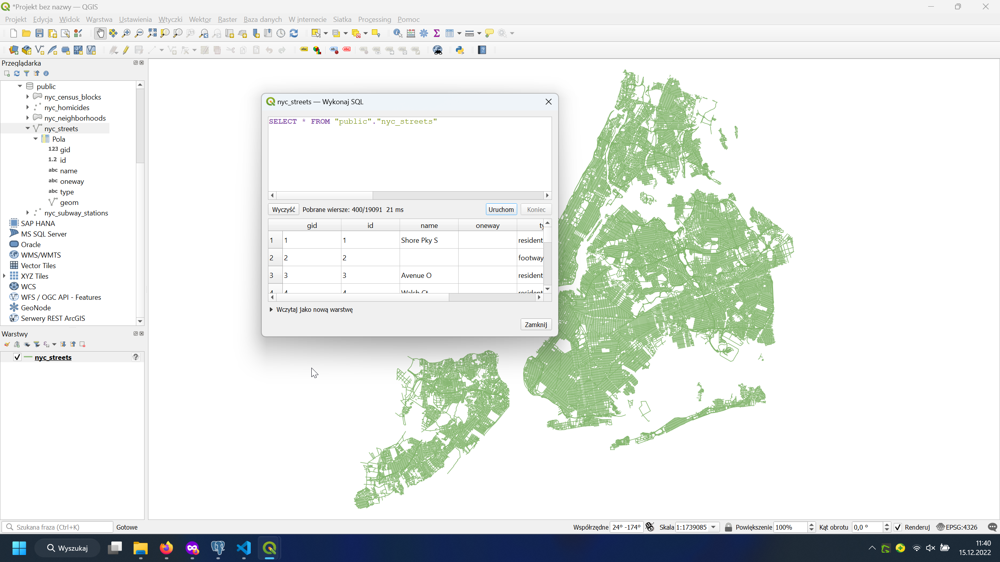
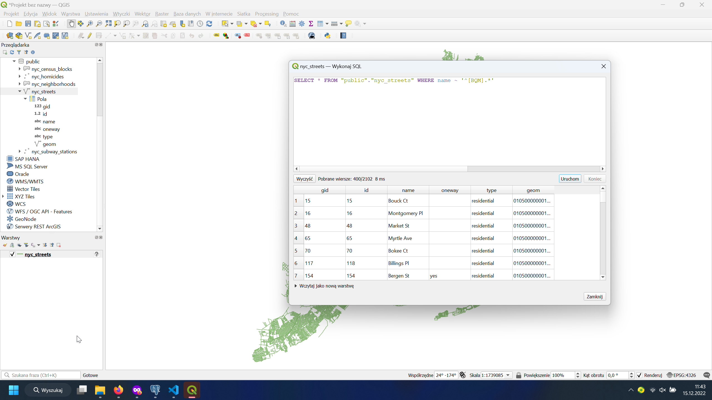
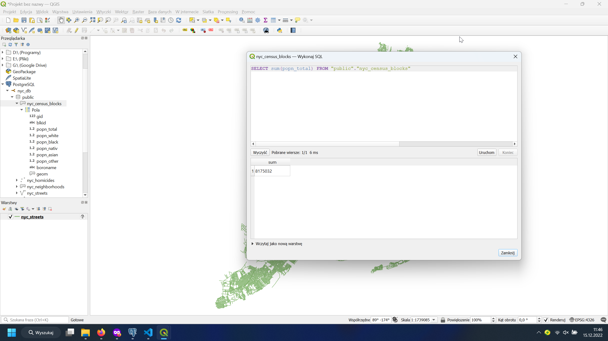
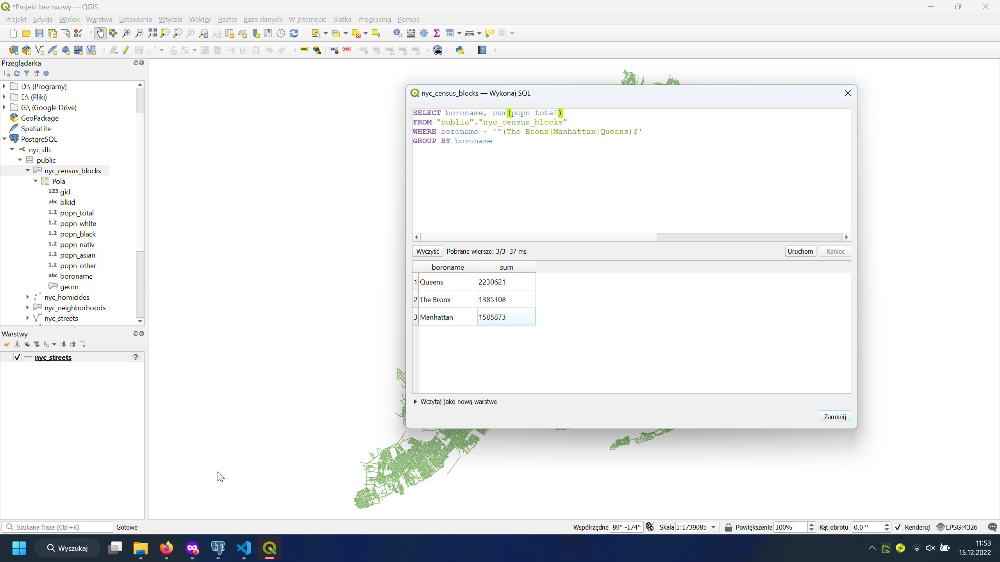
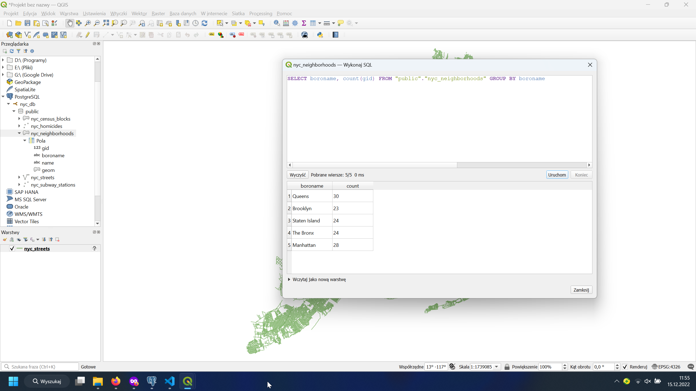

1. Ile rekordów znajduje się w tabeli nyc_streets?

Odp: 19091 rekordów.

2. Ile ulic w Nowym Jorku ma nazwy zaczynające się na „B”, „Q” i „M”?

Odp: 2102 ulice.

3. Jaka jest populacja miasta Nowy Jork?

Odp: 8 175 032 osoby.

4. Jaka jest populacja Bronxu, Manhattanu i Queens?

Manhattan: 1585873
Queens: 2230621
The Bronx: 1385108

5. Ile dzielnic ("neighborhoods") znajduje się w każdej gminie (borough)?

Brooklyn: 23
Staten Island: 24
Manhattan: 28
Queens: 30
The Bronx: 24

