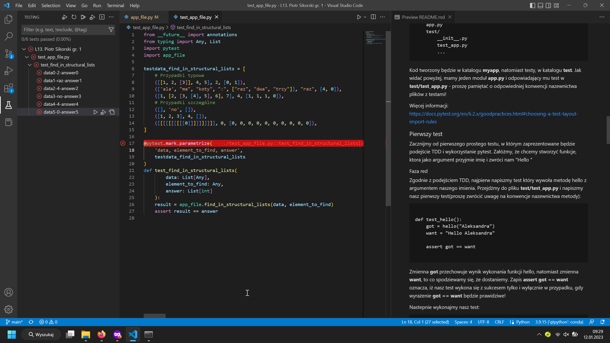
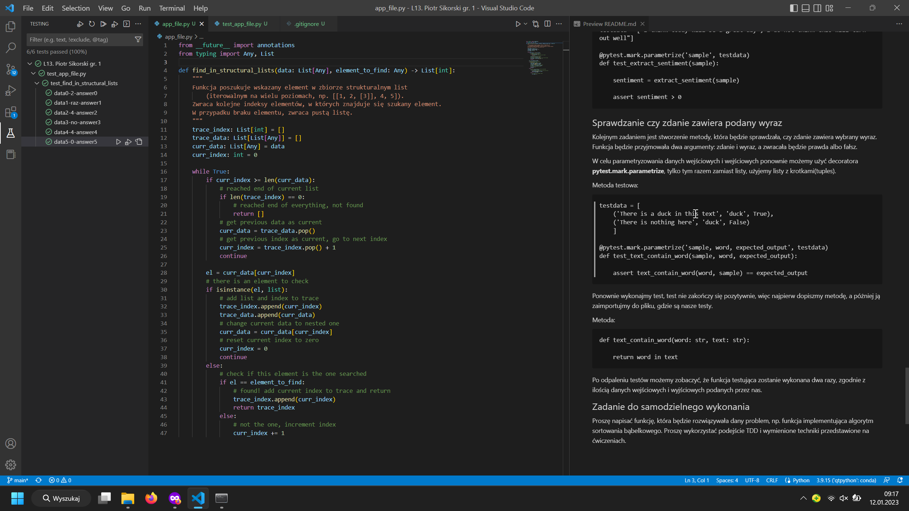

# Wykonanie ćwiczenia

*Lab 13. Piotr Sikorski, gr. 1*

Jako problem do rozwiązania wybrałem poszukiwanie ścieżki do elementu wśród list zagnieżdżonych.

## Faza RED

Polega na napisaniu testów jednostkowych dla danej funkcji.

## Faza GREEN

Polega na wykonaniu kodu funkcji tak, aby przechodził testy.

## Faza REFACTOR

Polega na poprawieniu działania napisanego kodu, pozbyciu się redundancji, dodaniu komentarzy, itp.

Ze względu na idealne napisanie kodu za pierwszym razem, ta faza nie wniosła żadnych zmian.