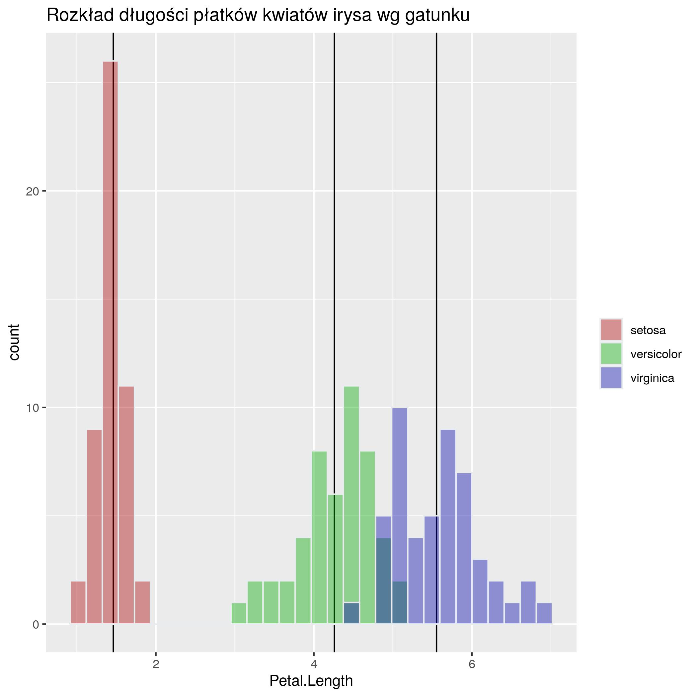
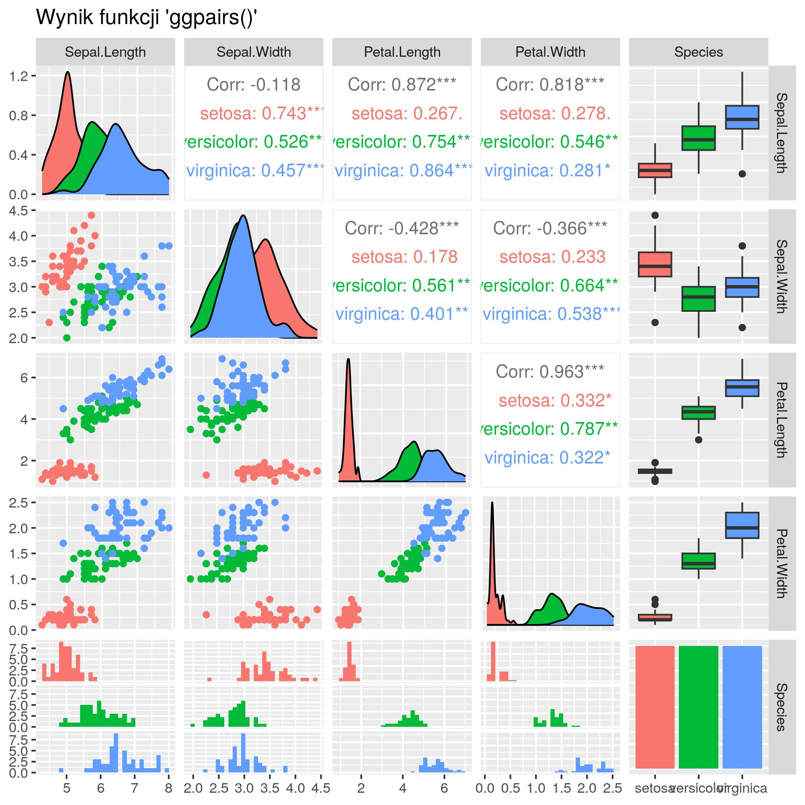
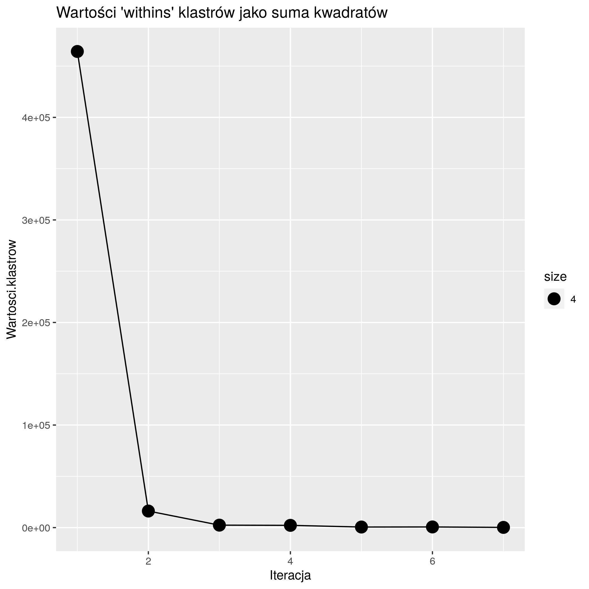
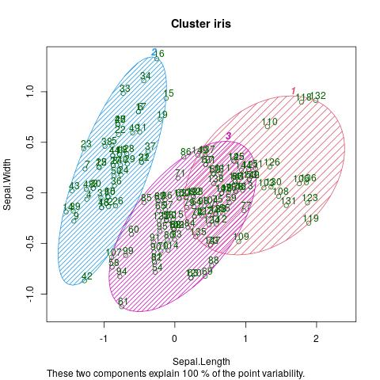
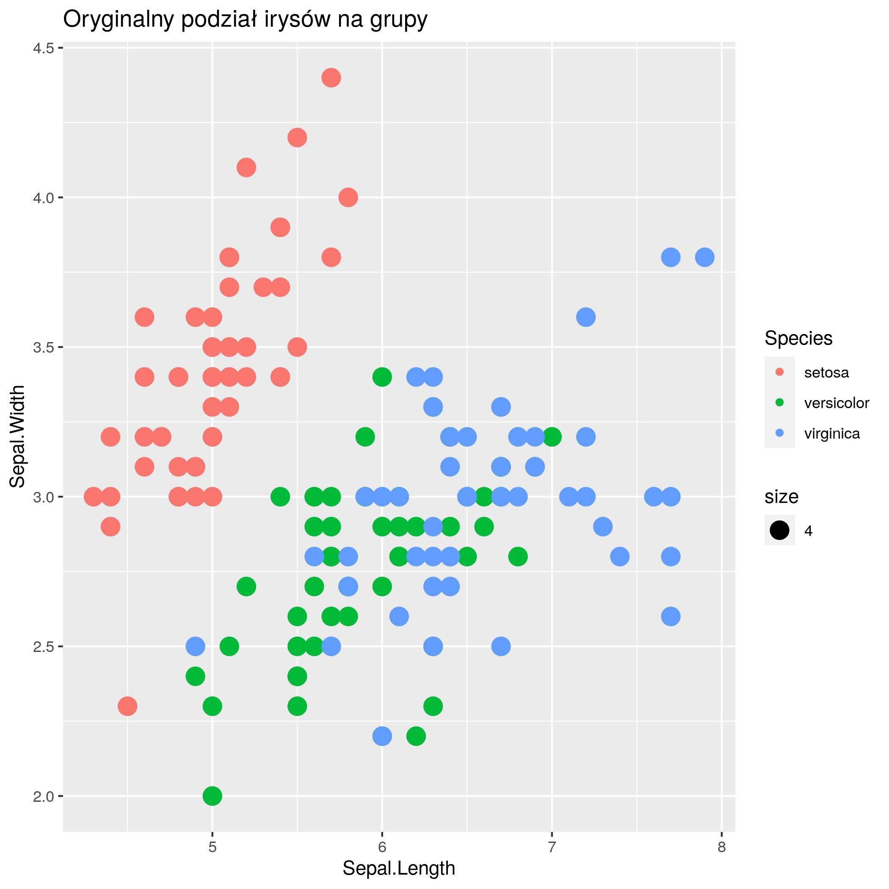

# L14. Piotr Sikorski gr. 1

## Jak uruchomić?

1. docker_image_r_base/build.cmd
2. docker_image_r/run.cmd

## Dane wynikowe zadania

```PowerShell
[1] " === ZADANIE 1 === "
[1] "1) [1, 2, 3, 4, 5, 6, 7, 8, 9, 10]"
[1] "2) 2.066735"
[1] "4)"
  Sepal.Length Sepal.Width Petal.Length Petal.Width Species
1          5.1         3.5          1.4         0.2  setosa
2          4.9         3.0          1.4         0.2  setosa
3          4.7         3.2          1.3         0.2  setosa
4          4.6         3.1          1.5         0.2  setosa
5          5.0         3.6          1.4         0.2  setosa
6          5.4         3.9          1.7         0.4  setosa
[1] "5)"
     Species Sepal.Length Sepal.Width Petal.Length Petal.Width
1     setosa        5.006       3.428        1.462       0.246
2 versicolor        5.936       2.770        4.260       1.326
3  virginica        6.588       2.974        5.552       2.026
[1] ""
[1] ""
[1] ""
[1] " === ZADANIE 2 === "
Saving 7 x 7 in image
`stat_bin()` using `bins = 30`. Pick better value with `binwidth`.
Saving 7 x 7 in image
`stat_bin()` using `bins = 30`. Pick better value with `binwidth`.
`stat_bin()` using `bins = 30`. Pick better value with `binwidth`.
`stat_bin()` using `bins = 30`. Pick better value with `binwidth`.
`stat_bin()` using `bins = 30`. Pick better value with `binwidth`.
[1] ""
[1] ""
[1] " === ZADANIE 3 === "
Saving 7 x 7 in image
null device 
          1
Saving 7 x 7 in image
```










